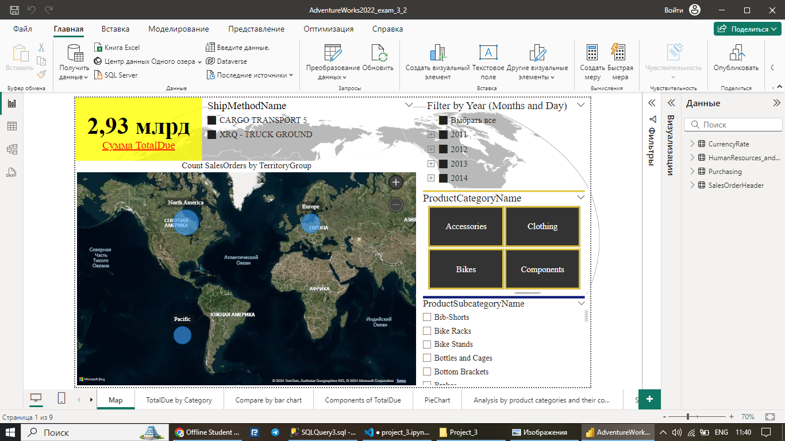
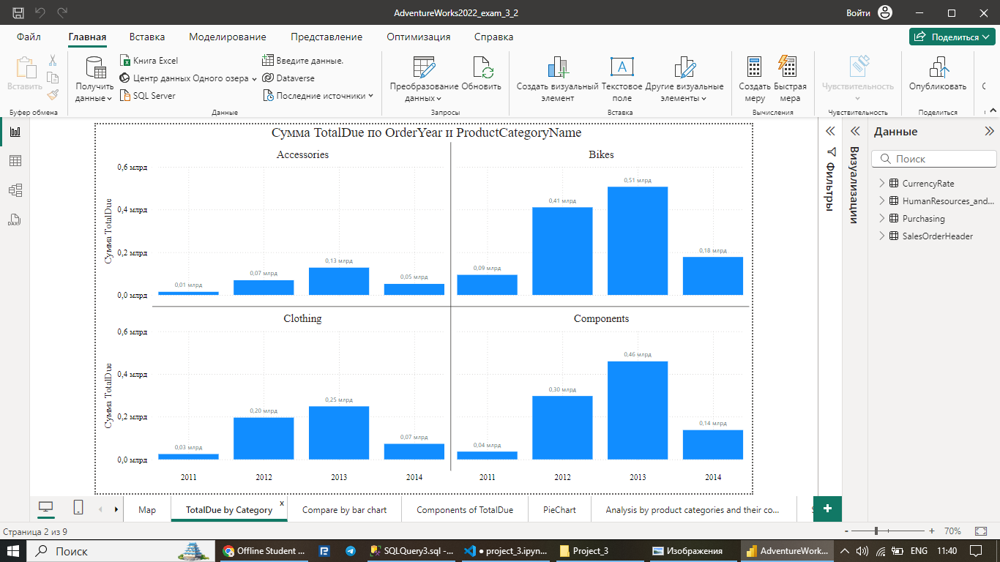
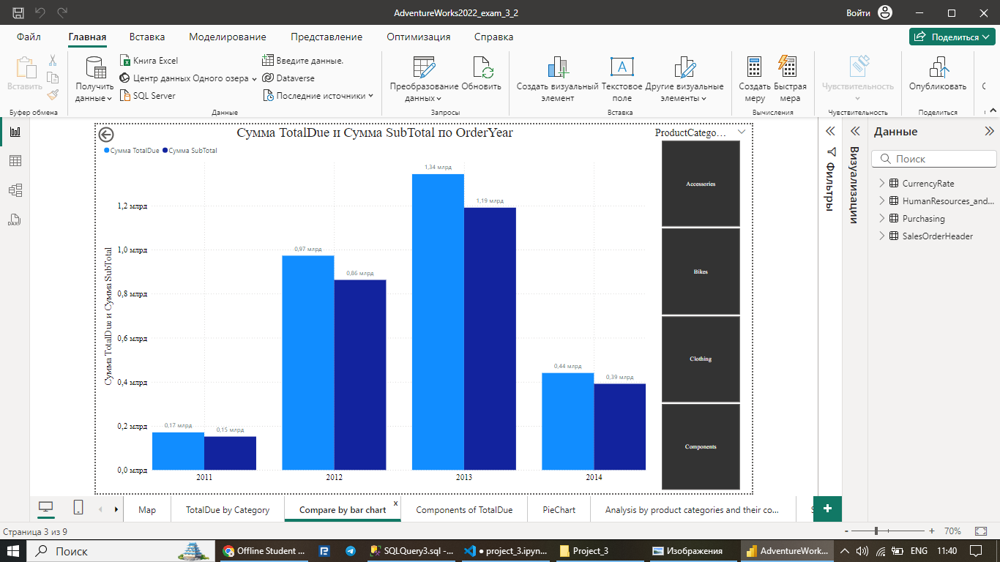
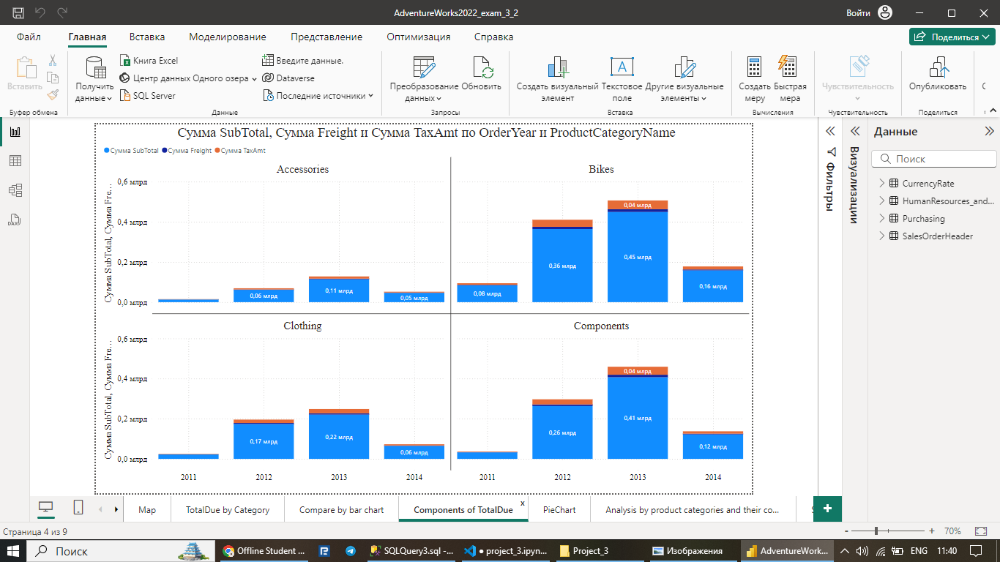
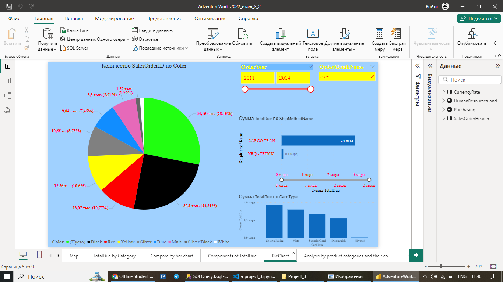
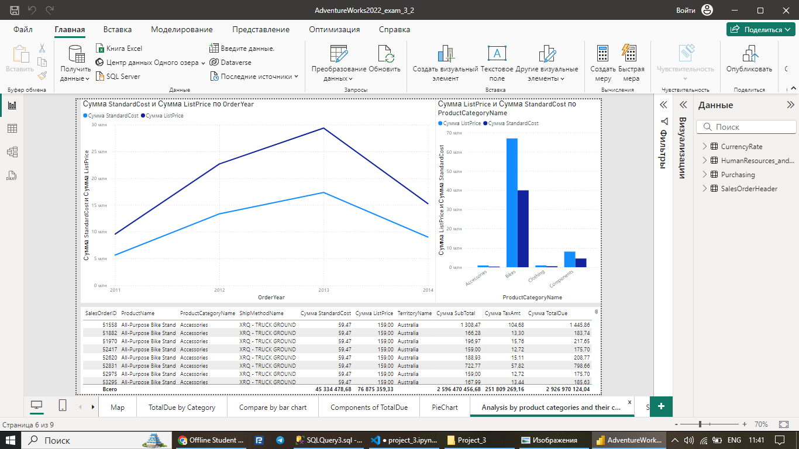
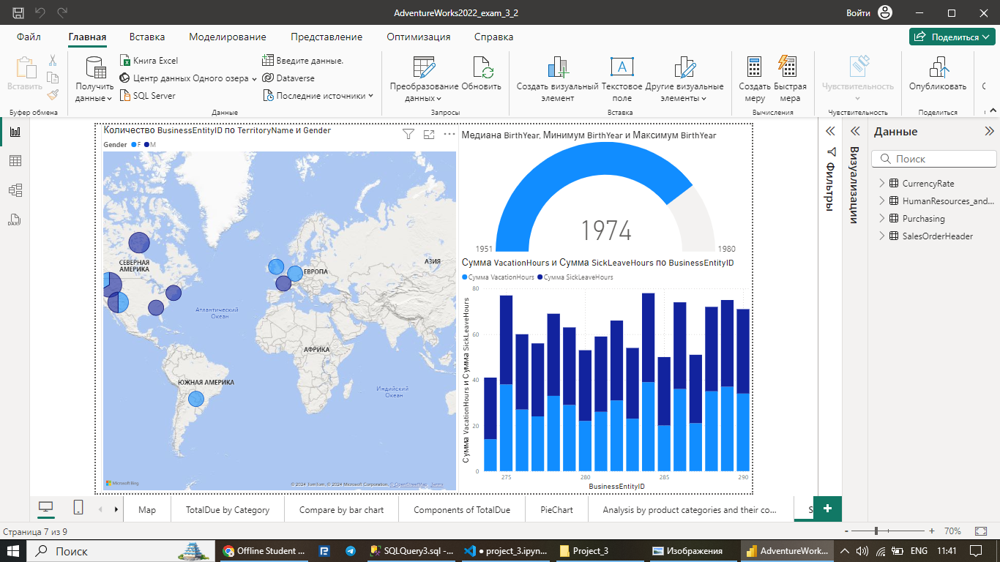
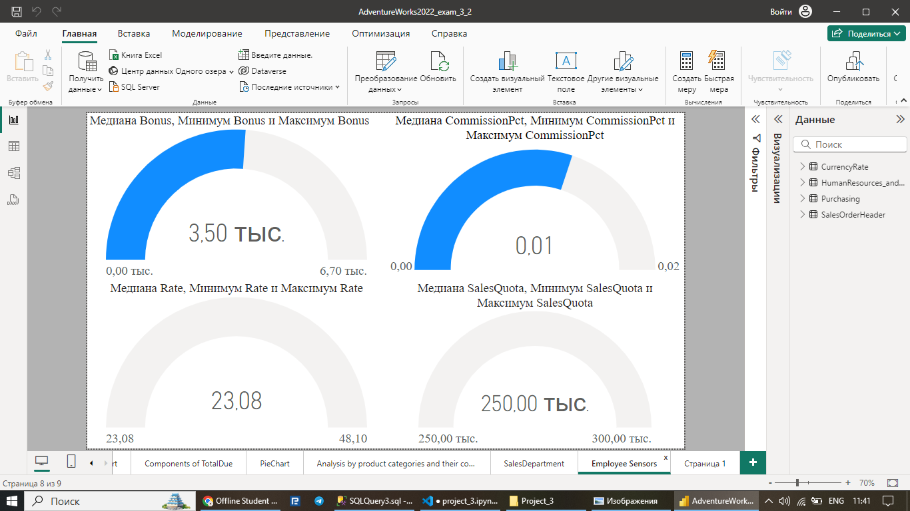

# AdventureWorks2022 Dashboard

## Overview

The **AdventureWorks2022 Dashboard** is designed to provide comprehensive insights into the business operations of AdventureWorks, covering human resources, sales, and purchasing activities. This dashboard leverages data from multiple tables within the AdventureWorks2022 database to help stakeholders analyze employee performance, sales trends, order details, and purchasing history.

## Data Sources

The dashboard pulls data from the following key areas:

1. **Human Resources (HR)**
   - Employee details such as organization level, job title, birth year, hire date, and salary history.
   - Department information including department name, group, and shift details.
   
2. **Sales**
   - Sales order details, including product, category, and pricing information.
   - Sales person performance, covering quotas, bonuses, and commission details.
   - Sales territories with grouping by regions and territories.

3. **Purchasing**
   - Purchase order details with vendor and shipping method data.
   - Financial information such as subtotal, tax, freight, and total due for each purchase order.

## Key Metrics and Insights

The dashboard covers a variety of metrics, offering insights across the following dimensions:

### 1. **Employee Metrics**
   - **Job Title and Department Information**: Provides a breakdown of employees by job title, department, and group.
   - **Hire Date and Employment History**: Tracks employee tenure and employment start/end dates.
   - **Salaried and Hourly Employees**: Analysis of salaried versus non-salaried employees, including vacation and sick leave usage.
   - **Pay History**: Displays employee pay rates and frequency.

### 2. **Sales Performance**
   - **Order Details**: Includes order date, due date, ship date, and the associated salesperson for each order.
   - **Product Information**: Lists product details, including name, number, model, and category.
   - **Sales Financials**: Tracks total due, tax, freight, and commission amounts for each order.
   - **Territory Insights**: Groups sales data by territory and territory group, providing a regional breakdown of sales performance.
   - **Sales Reason Aggregation**: Groups all sales reasons related to an order for a consolidated view.

### 3. **Purchasing Data**
   - **Vendor Information**: Displays vendor names, credit ratings, and associated purchase orders.
   - **Purchase Order Breakdown**: Provides details on purchase order quantities, unit prices, and total line amounts.
   - **Shipping Details**: Includes information on the shipping method, rates, and base shipping charges.

## Data Structure and Queries

The dashboard is built on SQL queries that utilize Common Table Expressions (CTEs) to structure data across multiple tables. The key queries include:

- **Employee Data**: A CTE that joins employee information with pay history and department history, providing a comprehensive view of each employee's details.
- **Sales Order Data**: Another CTE that aggregates sales order details with product, category, and territory information.
- **Purchase Order Data**: A final query that links purchase order headers with vendor details, shipping methods, and line item information.
## Dashboards

















## Usage

1. **Employee Performance Analysis**: Users can explore employee metrics like tenure, department affiliation, pay rates, and leave balances.
2. **Sales Tracking**: The dashboard offers detailed tracking of sales performance by region, product, and salesperson, including financial summaries like total sales, tax, and freight.
3. **Purchasing Overview**: Users can analyze purchasing patterns, vendor performance, and shipment details to optimize procurement processes.

## How to Use

- **Filter by Date**: The dashboard allows filtering by sales and purchase order dates, enabling analysis for specific time periods.
- **Product and Category Filters**: Filter sales by product name, category, or model for a more focused analysis.
- **Territory Filter**: View sales performance by specific territories or groups for regional insights.
- **Employee Drill-Down**: Drill down into employee data to view detailed histories and performance metrics.

## Future Improvements

Potential enhancements for the dashboard include:
- Adding real-time data integration for more up-to-date reporting.
- Including additional KPIs for vendor performance and procurement efficiency.
- Developing predictive models for sales and hiring trends.


# AdventureWorks2022 Dashboard and Stacking Regressor Project

## Overview

This project utilizes data from the **AdventureWorks2022** database to build a comprehensive dashboard and a machine learning model that predicts sales-related metrics. The project is divided into two main parts: an interactive dashboard displaying sales, employee, and product insights, and a machine learning model combining various regression techniques through stacking.

### Features of the Dashboard:

- **Sales Data Analysis**: Explore detailed insights into sales performance, order details, and sales trends.
- **Employee Data**: Analyze employee demographics, job information, pay history, and department assignments.
- **Product Analysis**: View data related to products, categories, pricing, and stock levels.
- **Territory Information**: Visualize sales territories and group performance.

The dashboard uses **Power BI** to display and interact with data, enabling users to filter and drill down on important metrics.

## Data Sources

- **Employee and Sales Data**: Information about employees, job titles, pay history, and department structure.
- **Sales Orders**: Data from sales orders, including products, quantities, discounts, and customer territories.
- **Product Details**: Product categories, subcategories, pricing, and stock levels.

Key data columns include:
- Employee-related: `BusinessEntityID`, `OrganizationLevel`, `JobTitle`, `BirthYear`, `MaritalStatus`, `HireDate`, `Rate`, `VacationHours`, `SalariedFlag`, `SalesYTD`.
- Sales-related: `SalesOrderID`, `OrderDate`, `SalesQuota`, `SalesLastYear`, `Bonus`, `CommissionPct`, `TerritoryName`, `TotalDue`.
- Product-related: `ProductName`, `ProductCategoryName`, `StandardCost`, `ListPrice`, `SafetyStockLevel`.

## Machine Learning Model

The machine learning model employs **stacking regression** to predict sales metrics. The stacking regressor uses a combination of several models, each enriched with polynomial features and scaling to manage feature complexity and outliers. The final model provides an enhanced prediction based on the strengths of each individual model.

### Pipelines for Each Model with Polynomial Features and Scaling:

1. **Ridge Regression**: Uses polynomial features (degree 6) and robust scaling.
2. **Lasso Regression**: Polynomial features (degree 4) with robust scaling.
3. **Huber Regression**: Polynomial features (degree 3) with robust scaling.
4. **Linear Regression**: Polynomial features (degree 5) with robust scaling.

### Stacking Regressor:

A **Stacking Regressor** is built using the above models. The final meta-estimator is a **Huber Regressor** with `alpha=0.001`, which balances robustness and predictive accuracy by combining the outputs of the individual models.

### Model Metrics:

The following metrics are used to evaluate the model's performance:

- **Mean Absolute Error (MAE)**: Measures the average magnitude of the errors.
- **Median Absolute Error (MedAE)**: Focuses on the median magnitude of the errors.
- **R² Score (R2)**: Indicates the proportion of variance explained by the model.
- **Mean of Predictions**: The average value of predicted sales metrics.

### Model Equation:

The final Huber Regressor model's equation is derived using the learned coefficients and intercept. The equation can be written as:

```
y = [intercept] + coeff1 * x1 + coeff2 * x2 + ... + coeffN * xN
```

Where `x1, x2, ..., xN` represent the model's input features, and `coeff` represents the contribution of each feature to the final prediction.

## How to Use

1. **Power BI Dashboard**: The dashboard allows interactive exploration of the data. Filter by regions, salespeople, products, and time periods to get customized insights.
2. **Machine Learning Model**: The stacking model is trained using polynomial features and robust scaling. You can modify the degree of the polynomial or the choice of meta-estimator for different predictive outcomes.

## Future Improvements

- **Feature Engineering**: Explore additional features, such as seasonal sales trends or employee performance indicators, to improve model accuracy.
- **Visualization Enhancements**: Add more interactivity and drill-down options in the Power BI dashboard.
- **Model Optimization**: Experiment with other regression models or ensemble methods to further improve performance.
